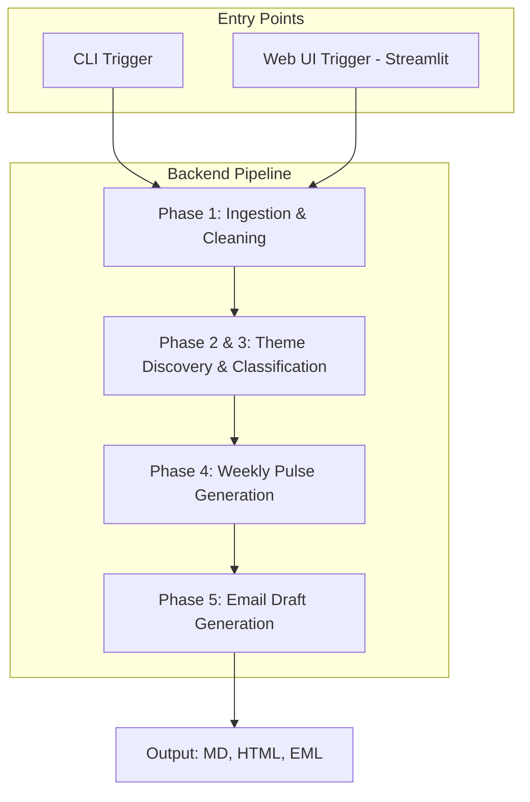

# Technical Architecture: Groww Review Insights System

## Project Objective
A system that converts recent Google Play Store reviews of the Groww app into a one-page weekly product pulse for Product, Growth, Support, and Leadership teams.

---

## 1. System Architecture Overview
The system is built as a **Unified Backend Pipeline** with two distinct **Entry Points** for triggering execution. Both entry points call the same sequence of processing phases, ensuring consistent results regardless of the interface used.

### The Entry Points
*   **CLI Trigger:** Useful for developers, automation, and scheduled runs (e.g., cron jobs).
*   **Web UI Trigger (Streamlit):** Useful for manual execution, quick adjustments, and previewing results before distribution.

### The Core Pipeline Phases
1.  **Review Ingestion & Cleaning**: Programmatically fetching and sanitizing reviews.
2.  **Theme Discovery & Classification**: Extracting insights using Groq LLM.
3.  **Weekly Pulse Generation**: Creating the concise product report and action ideas.
4.  **Email Draft Generation**: Packaging the report into a ready-to-send email.

---

## 2. Deliverables
The system will produce the following outputs:
1.  **Working Prototype:** A Streamlit-based web application.
2.  **Weekly Product Pulse:** A concise (< 250 words) document in PDF and Markdown formats.
3.  **Draft Email:** A pre-composed email ready for sending to stakeholders.
4.  **Reviews Dataset:** A sanitized CSV/JSON file containing the source reviews for the period.
5.  **README:** Documentation on pipeline execution and theme legends.

---

## 3. Phase-Wise Architecture

### Phase 1: Review Ingestion & Cleaning
*   **Objective:** Programmatically fetch, sanitize, and persist recent reviews for the Groww app.
*   **Components:** `google-play-scraper`, Pandas, `re`, `langdetect`.
*   **Implementation Details:** 
    *   **Fetch:** API call `reviews('com.nextbillion.groww', lang='en', country='in', sort=Sort.NEWEST, count=2000)`.
    *   **Timeframe:** Filter for reviews from the last 12 weeks using the `at` field.
    *   **Extraction:** Extract `review text`, `rating`, `review date`, and `number of people who found this review helpful`.
    *   **PII Filtering:** Apply a `pii_filter` function to redact emails, phone numbers, and other PII.
    *   **Data Cleaning:** 
        *   Remove reviews with fewer than 5 words.
        *   Exclude reviews containing emoji characters.
        *   Filter for English language only (configurable).
    *   **Data Privacy:** Discard review titles to prevent accidental PII storage.
    *   **Persistence:** Save the cleaned dataset to `data/phase_1_ingestion/YYYY-MM-DD.json`.
    *   **Metadata included in JSON:** `scrapedAt`, `packageId`, `weeksRequested`.
*   **Data Flow:** Fetch reviews → Filter by date → Apply PII filtering and data cleaning → Store in Pandas DataFrame → Save cleaned dataset to `data/phase_1_ingestion/YYYY-MM-DD.json`.
*   **Edge Cases:** Rate limiting; non-English reviews in Roman script; directory permissions.

### Phase 2: Theme Discovery using Groq [IMPLEMENTED]
*   **Objective:** Identify 3–5 core themes present in the review batch.
*   **Components:** Groq API (target model: `llama-3.3-70b-versatile`).
*   **Implementation Detail:** 
    *   **Sampling:** Take a sample of 100–150 reviews, ensuring representation from different ratings (1 to 5 stars).
    *   **Task:** identify 3 to 5 main themes across the sample.
    *   **Output Format:** Structured JSON containing:
        *   `theme id`
        *   `theme label`
        *   `short description`
    *   **Error Handling:** If the LLM output is not valid JSON, retry exactly once.
    *   **Constraint:** This phase is strictly for theme discovery; do **not** classify reviews in this phase.
    *   **Persistence:** (Optional) Save the list of themes to `data/phase_2_discovery/themes-YYYY-MM-DD.json` for debugging.
*   **Edge Cases:** Redundant themes; LLM hallucinations; exceeding context window; invalid JSON output.

### Phase 3: Review Classification into Themes [IMPLEMENTED]
*   **Objective:** Map every review to one of the discovered themes from Phase 2.
*   **Components:** Groq API (batch processing).
*   **Implementation Detail:** 
    *   **Input:** Uses the discovered themes from Phase 2 and the full cleaned review dataset.
    *   **Batching Strategy:** Reviews are sent to Groq in batches of approximately 50 reviews at a time to optimize performance and cost.
    *   **Task:** The LLM assigns each review to exactly one of the provided themes.
    *   **Output Format:** Structured JSON response showing reviews grouped by theme. Each theme contains its name and a list of related reviews, with each review entry including:
        *   `review text`
        *   `review date`
        *   `rating`
        *   `helpful count`
    *   **Unclassified Category:** If a review does not fit into any of the discovered themes, it is assigned to an "unclassified" category.
    *   **Error Handling:** Implement handling for API rate limits by retrying the request if an error occurs.
    *   **Persistence:**
        *   Save grouped results to `data/reports/grouped_reviews-YYYY-MM-DD.json`.
        *   (Optional) Save the list of themes separately for debugging purposes in `data/phase_2_discovery/`.
*   **Edge Cases:** Rate limiting; ambiguous reviews; invalid JSON output for a batch.

### Phase 4: Weekly Pulse & Action Idea Generation
*   **Objective:** Synthesize insights into a concise, readable format (< 250 words).
*   **Components:** Groq LLM.
*   **Task:** The AI should act as a product communications writer for the Groww team and create a short weekly summary based on the grouped user reviews. The summary must clearly include:
    *   Top themes
    *   Real user quotes
    *   Action ideas for the product team
*   **Privacy & Formatting Rules:**
    *   **Title:** Add a clear title at the top in this format: `GROWW Weekly Review Pulse -- Week of {date}` (e.g., Week of 8th March 2026).
    *   **Theme Descriptions:** In the Top Themes section, list the top 3 themes using a numbered list. For each theme, add a short description based on the reviews using bullet points (to avoid double-numbering); mention the review count using the format `({count} mentions)`.
    *   **Quotes Section:** Name the quotes section "What do users say".
    *   **Quote Formatting:** 
        *   Display each quote on a separate line.
        *   Add a blank line between quotes so they are clearly separated.
        *   Format the quotes as a numbered list.
        *   At the end of each quote, include the star rating of that review in this format: `— X★ review`.
    *   The weekly pulse must not include any personal information from user reviews. If a review contains a name or any personal detail, it should be removed or replaced with `[User]`.
    *   Quotes used in the weekly pulse must come directly from the original reviews and should not be changed.
*   **Data Flow:** 
    *   **Input Source:** The grouped reviews file generated in Phase 3 (`data/reports/grouped_reviews-YYYY-MM-DD.json`). This file contains reviews already grouped by themes and will be used to generate the weekly pulse.
    *   **Input Data:** Theme counts, descriptions + Top 3 representative reviews with ratings (derived from the grouped reviews file) + Action prompt.
    *   **Output:** A structured Markdown string containing the Top 3 themes with descriptions, 3 quotes with ratings, and 3 action items.
*   **Persistence:**
    *   Save the weekly pulse as a Markdown file named `pulse-YYYY-MM-DD.md` inside the `data/phase4/` folder.
    *   Generate a plain text version of the same pulse so it can be used easily in the email body.
*   **Edge Cases:** Word count exceeding 250 words.

### Phase 5: Email Draft Generation
*   **Objective:** Automate the communication of the product pulse.
*   **Components:** `smtplib` / Google API or simple `mailto:` link generator for UI.
*   **Data Flow:** 
    *   **Input Source:** The weekly pulse file generated in Phase 4 (e.g., `data/phase4/pulse-YYYY-MM-DD.md` or `.txt`).
    *   **Task:** Read the pulse file and use its content to format a professional email draft.
*   **Email Structure:**
    *   **Subject:** `GROWW Weekly Review Pulse -- Week of {date}`
    *   **Body:** Start with a simple greeting (e.g., "Hi Team,"). Following the greeting, include the weekly pulse content exactly as generated in Phase 4.
    *   **Required Sections:** The email must clearly display the sections: `Top Themes`, `What do users say`, and `Action Ideas`.
    *   **Formatting:** Section titles (`Top Themes`, `What do users say`, and `Action Ideas`) should appear in bold and slightly larger font than the rest of the text.
*   **Sender & Recipient Handling:**
    *   **Sender:** A sender email address from which the weekly pulse will be sent.
    *   **Recipient:** A recipient email address where the weekly pulse will be delivered. The recipient can either come from the system configuration or be provided when the email is generated.
*   **Email Formats:** The email should support two formats:
    *   **Plain Text:** A plain text version.
    *   **HTML:** An HTML version generated from the weekly pulse Markdown.
*   **Delivery Modes:**
    *   **Auto-Send Logic:** The system automatically determines the delivery mode based on the environment configuration (`.env`).
        *   If all required SMTP variables (`SMTP_SENDER_EMAIL`, `SMTP_SENDER_PASSWORD`, `SMTP_SERVER`, `SMTP_PORT`, `SMTP_RECIPIENT_EMAIL`) are present, the system will **Send** the email.
        *   If any of these values are missing, the system will automatically fall back to **Dry-run Mode**, generating the `.eml` draft locally without attempting to connect to the server.
*   **Configuration & Security:**
    *   Email credentials and server details should come from the project configuration.
    *   **CRITICAL:** Ensure that passwords or credentials are never logged or stored in output files.
*   **Edge Cases:** Email formatting issues; SMTP authentication failures.

### Phase 6: Trigger Layer (Entry Points)

#### 6.1: CLI Trigger
*   **Objective:** Provide a command-line interface for automation and developers.
*   **Mode of Operation**: CLI Trigger allows running the pipeline via terminal commands.
*   **Features:**
    *   **Phase-Specific Runs:** Individual triggers for specific phases (`scrape`, `analyze`, `classify`, `report`, or `email`).
    *   **Full Pipeline:** A single command to execute the entire sequence (`all`).
    *   **Configurable Window:** Ability to choose the review window (8–12 weeks).
    *   **Optional Email Delivery**: Flag to determine if the email should be sent after generation.
    *   **Recipient Overrides**: Options to optionally set recipient email and name.
*   **Integration**: The CLI reuses the same underlying pipeline modules as the UI.

#### 6.2: Web UI Trigger
*   **Objective:** Provide a professional web-based dashboard to manage and trigger the insights pipeline.
*   **Components:** Streamlit.
*   **Features:**
    *   **Timeframe Control:** Option to choose the review window (8–12 weeks).
    *   **Pipeline Execution:** Central button to run the full pipeline.
    *   **Live Preview:** Rendering of the generated Weekly Pulse.
    *   **Optional Email Delivery**: Checkbox to optionally send the email after generation.
    *   **Artifact Downloads**: Button to download the generated email draft (`.eml`).
*   **Integration**: The UI triggers the same backend pipeline modules used by the CLI.

#### 6.3: Scheduler
*   **Objective**: Automate the weekly pulse generation at fixed intervals.
*   **Mode of Operation**: A persistent background process that triggers the full pipeline.
*   **Default Configuration**:
    *   **Interval**: Every 5 minutes (configurable).
    *   **Review Window**: 8 weeks.
    *   **Limit**: Up to 1000 reviews.
*   **Logging**: All runs and errors are logged to `data/logs/scheduler.log`.
*   **Configuration**: Integrated with `.env` for interval, recipient, weeks window, and max reviews.
*   **Integration**: Direct reuse of the backend pipeline classes, ensuring parity with CLI and UI triggers.

#### 6.4: GitHub Actions Scheduled Run
*   **Objective**: Cloud-based automation for the weekly pulse.
*   **Mode of Operation**: GitHub Actions workflow triggered by a schedule (cron) or manual trigger (workflow_dispatch).
*   **Environment**: Runs in a Python environment on GitHub-hosted runners.
*   **Security**: Uses GitHub Repository Secrets for sensitive credentials (`GROQ_API_KEY`, `GEMINI_API_KEY`, `EMAIL_SENDER`, `EMAIL_PASSWORD`).
*   **Schedule**: Runs once per week (default: Mondays at 00:00 UTC).
*   **Manual Trigger**: Supports the `workflow_dispatch` event to allow team members to trigger a pulse generation manually from the GitHub UI.

---

## 4. Operational Strategy

### Weekly Rerun Pipeline
1.  **Step 1:** Choose an Entry Point (CLI: `src/main.py` or Web UI: `streamlit run src/app.py`).
2.  **Step 2:** Select the Review Window (e.g., 12 weeks).
3.  **Step 3:** Trigger the Pipeline (Full run or specific phases).
4.  **Step 4:** Review the Pulse (MD file or UI preview).
5.  **Step 5:** Finalize Output (Send email or download `.eml` draft).

### PII Protection
Systematic scrubbing of PII and exclusion of sensitive fields (userNames, titles) occurs during the cleaning step in Phase 1. The LLM only receives sanitized review text, ratings, and dates.

### Error Handling & Reliability
- **Retry Logic:** For Groq API calls (exponential backoff).
- **Fallback:** If theme discovery fails, use a predefined set of common fintech themes (Login, KYC, UI, Transaction).
